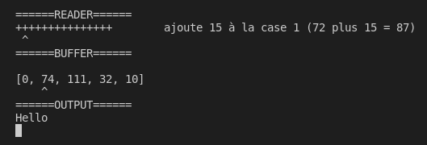

# Simple Brainfuck interpreter in Bah
This is a really simple Brainfuck interpreter written in Bah.
This was made in 15 minutes so may not be the mose complexe interpreter.

## Usage
#### Interpret file
To interpret a brainfuck program, use `./main <file>`.
```sh
./main helloworld.bf
```

#### Debug file
To interpret a file in debug mode, use `./main <file> -debug`.
You will need to press any key to interpret the next instruction.
```sh
./main helloworld.bf -debug
```
This will output the following:
[](https://youtu.be/E5j0Pcf_fg4)

## Compilling the interpreter
To compile the interpreter, do `bah main.bah`.